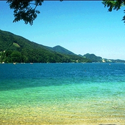
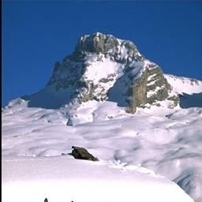

# Binary Image Classifier

A Simple binary image classifier that is built using Keras's sequential models. The neural net consists of 7 layers including 2 dense layers for classification at last , and a couple of convolution Layers and Max pooling layers to reduce the size of the convolution ouput and a Flatten layer to flatten the final multi-dimensional convolutional output.

## Experiment 

The training dataset consists of 700 images of mountains and coasts images. The training accuracy of the model is just shy of 92%.

The model predicts the classes of the following images properly.

